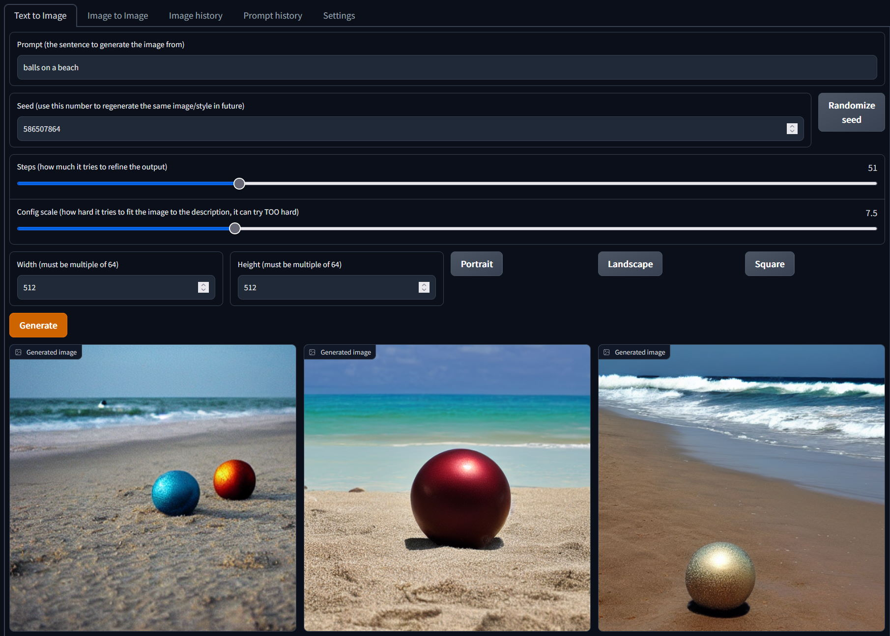

# SDGG - Stable Diffusion Gradio GUI

This is a web-based user interface for generating images using the Stable Diffusion repository.

**NOTE**:
* This was done quickly to solve a problem, not to win code quality awards. You can file issues if you feel like it, though :shrug:
* This produces uncensored results, be aware.

(for my own sake: I've barely spent any time trying to understand the whole ML framework and Gradio, and I hacked this together as quickly as I could so that I could put it up before I start my new job)



### Quickstart

1. Clone [this fork](https://github.com/lstein/stable-diffusion) of the Stable Diffusion repo and create the environment  (you can use the official one, see longer start below)
2. Clone this repo and copy the files to the same folder you just cloned the above to
3. Run `pip install gradio`
4. Run `python scripts\sdgg.py`
    * optionally pass `-s 0` to generate images in parallel (slight time saving)
        * AND optionally pass `-bs 1` to only generate 1/2/3 image(s) at the same time, if you're having memory issues with parallel
5. Wait for it to load and show a message like `Running on local URL:  http://127.0.0.1:7860/`
6. Browse to that address in your browser and start generating!

### Longstart (using the offical repo)

I initially cloned the forked repo because it had `dream.py` in it, an interactive console application that I thought was neat.
However, if that fork ever stagnates, you can use the [official repo](https://github.com/CompVis/stable-diffusion), but copy two files from the fork to the official:
```
ldm/models/diffusion/ksampler.py
ldm/simplet2i.py
```
and you'll need one extra `pip` installation:
```
pip install -e git+https://github.com/lstein/k-diffusion.git@master#egg=k-diffusion
```

Then continue from (3) in the quickstart.

### Features

* simple GUI to adjust most common generation settings
* saves all the prompts you use to a database so you can reuse them in future (searching by keyword coming soon, maybe)
* saves your session details so if the server restarts and you refresh your page, you'll get where you last left off
* tries to prevent generating the same images again, if they're found, they'll be returned immediately from the outputs folder
* provides rudimentary browsing of generated images, allowing you to copy settings used for generating

### GOTCHAs

* clicking "use" on the prompt history tab or "use settings" on the image history tab WILL copy the settings to the "text to image" tab, but you'll have to swap tabs manually
* the prompt history will not contain new prompts until the server is restarted (you can however use the image history)
* hard-coded to generate 3 images at the moment
* the seeds reported on the second 2 images is wrong, I can't figure out how to get the internal seeds used

### TODO

Oh so SO much
* add proper searching through prompts (matches, contains, is like, etc.)
* add support for img2img
* wait for the dropdown bug to be fixed so new prompts can be added to the prompt history without restarting the server first
* refactor out into different classes, get rid of globals, etc.
* refactor to use offical repo without changes
* file/fix Gradio bugs so that things like using a dropdown box work to cause actions to happen, to get rid of some buttons
* figure out how to make buttons occur before the elements they act on
* figure out how to make the images in the gallery clickable (not possible in Gradio at the moment, and _js fails to work)
* add a settings tab
